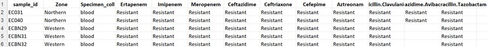
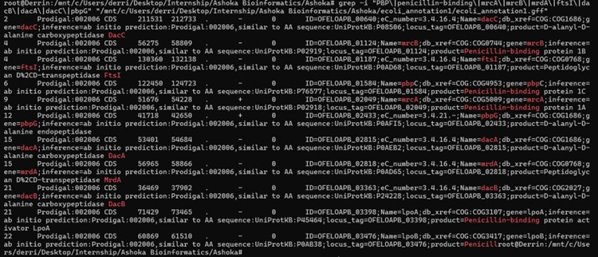
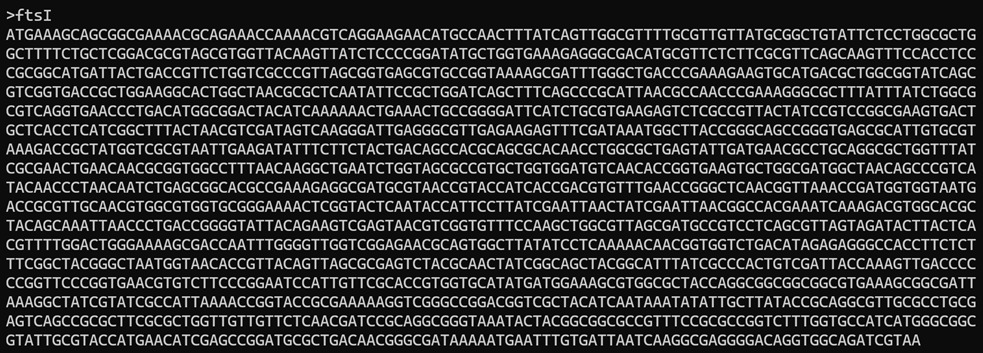
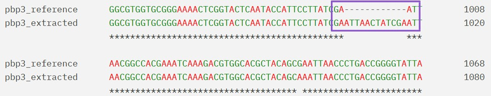
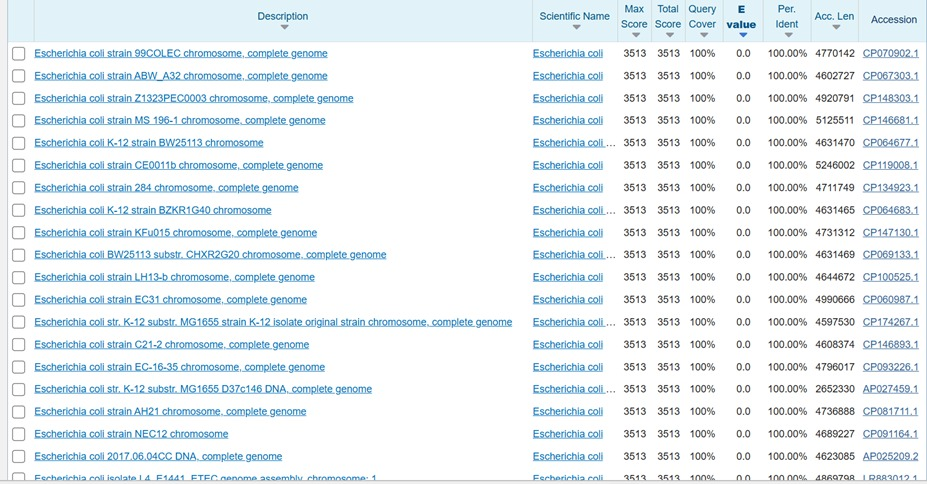
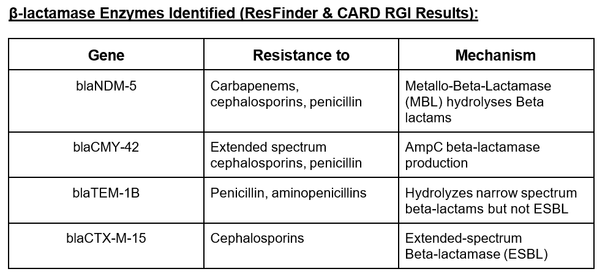
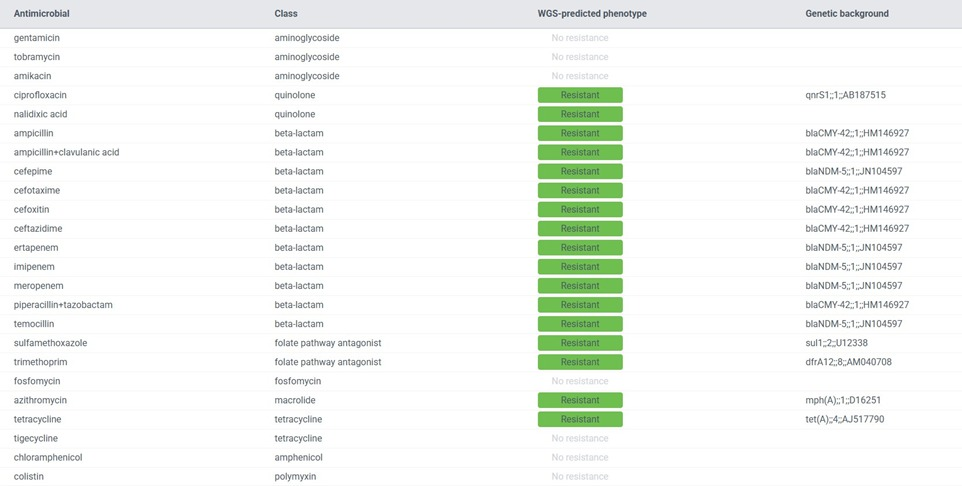
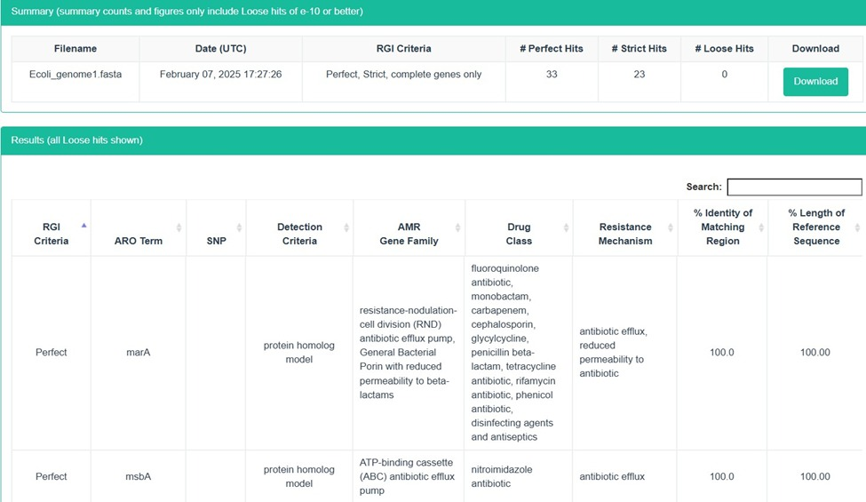

***************************************************************************
 #   A Multi-Modal Genomic Analysis of Beta-Lactam Resistance Mechanisms in Five Clinical *E. coli* Isolates   #
***************************************************************************

* **Project Context and Collaborators**
  * This project was conducted in collaboration with Ashoka University and a partner hospital.
  * Five clinical isolates of *Escherichia coli* were collected directly from patient samples at the hospital, sequenced, and analyzed to understand their resistance to beta-lactam antibiotics.
  * The isolates represented multidrug-resistant (MDR) strains and were chosen based on clinical resistance patterns observed in routine healthcare diagnostics.

* ****************************************************************************

* **Main Objective**
  * To determine whether resistance to beta-lactam antibiotics (including carbapenems, cephalosporins, and monobactams) in these isolates is due to:
    * Mutations in penicillin-binding protein 3 (PBP3, encoded by *ftsI*), especially insertions or substitutions.
    * The presence of acquired antibiotic resistance genes (ARGs), specifically beta-lactamase genes.
    * Additional mechanisms, such as efflux pump systems.

* ****************************************************************************

* **Methods Overview**

  * *Sample Processing & Sequencing:*
    * Five clinical *E. coli* isolates were cultured and subjected to whole-genome sequencing.

  * *Cultural Sensitivity/AST Data:*
    

 

  * *Genome Annotation:*
    * Genomes annotated using *Prokka*. Example below:  
      
 
    * Focus placed on genes encoding PBPs (PBP1a, PBP1b, PBP2, PBP3, PBP4, PBP5, PBP6).

  * *PBP Gene Extraction & Mutation Analysis:*
    * Custom Biopython scripts used for PBP extraction.  
      
    * Blast and alignment results showing the insertion:  
      
    

  * *Resistance Gene & Efflux System Detection:*
    * ResFinder and CARD-RGI employed. Results below:  
      
      
    

  * *Phenotypic Correlation:*
    * Comparison of genomic findings with AST resistance profiles (refer also to the cultural sensitivity image above).

* ****************************************************************************

* **Key Findings**

  * *Genomic Mutation Analysis:*
    * A 12-bp insertion (ATTAACTATCGA) was found in the PBP3 gene of all isolates, likely disrupting drug binding.  
      
    

  * *Antibiotic Resistance Genes (ARGs):*  
    * Multiple beta-lactamases identified including **blaNDM-5**, **blaCMY-42**, **blaCTX-M-15**, **blaTEM-1B**.  
      
    

  * *Efflux and Additional Resistance:*  
    * RND family efflux pump genes detected by CARD.  
    

  * *Phenotype-Genotype Concordance:*
    * AST tests confirmed high-level resistance to aztreonam, avibactam, and carbapenems, matching genomic predictions.

* ****************************************************************************

* **Conclusion and Implications**

  * Resistance is **multi-factorial**, involving:
    * The PBP3 insertion mutation alters beta-lactam binding.
    * Several potent beta-lactamase enzymes.
    * Efflux pump systems enhancing multidrug resistance.
  * PBP3 insertion is a critical factor in aztreonam-avibactam resistance.
  * Highlights the urgent need for continued genomic surveillance in clinical settings.
  * Standard beta-lactam treatments may fail; alternate therapies should be explored.
  * Demonstrates the strength of genomics and bioinformatics in antibiotic resistance research.

* ****************************************************************************

* **Project Credits**

  * Analyses performed at Ashoka University with hospital collaboration.
  * Bioinformatics tools: *Prokka*, *Biopython*, *ResFinder*, *CARD-RGI*.
  * Supports clinical antibiotic stewardship and research.

***************************************************************************
